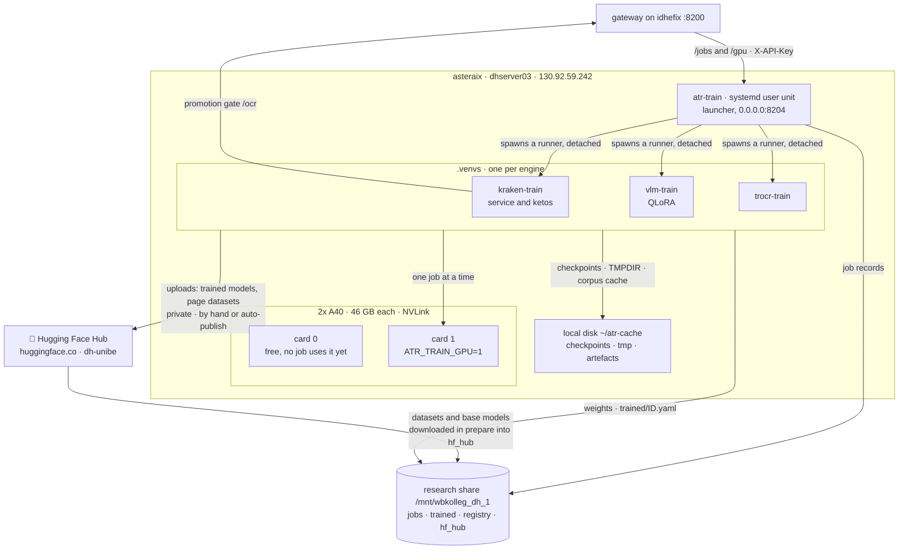

# training-atr-models

Training für ATR-Modelle — kraken, TrOCR und VLM-Feinabstimmung. Herausgelöst aus
[`serving-atr-inference`](https://github.com/thodel/serving-atr-inference) am
16.09.2026, läuft auf **asteraix** (130.92.59.242).

## Die Maschine

Beschrieben in drei Dokumenten (englisch):

- [`docs/INFRASTRUCTURE.md`](docs/INFRASTRUCTURE.md) — asteraix im Detail: der
  Dienst und sein Launcher, die drei venvs, der Lebenslauf eines Jobs, was
  lokal und was auf dem Share liegt, die Karten, UBELIX.
- [`docs/OPERATIONS.md`](docs/OPERATIONS.md) — Deploy, Abbrechen und neu
  Einreichen, `.env` ändern, Logs, Registrierung von Hand, fremde Job-Einträge
  schliessen.
- [`docs/BASE_MODEL_LADDER.md`](docs/BASE_MODEL_LADDER.md) — welches
  Basismodell und welche Grösse als Nächstes: was gemessen ist, warum eine
  Matrix bezahlbar ist (ein prepare, N Arme), die Kandidaten inklusive
  Qwen3.8 und Gemma 4, und in welcher Reihenfolge gerechnet wird.

Das **Gesamtbild** beider Maschinen — idhefix, die Clients, alle Kanten, das
Share und die Werte, die auf beiden Maschinen übereinstimmen müssen — steht im
Serving-Repo:
[`docs/INFRASTRUCTURE.md`](https://github.com/thodel/serving-atr-inference/blob/main/docs/INFRASTRUCTURE.md).

## Wie ein Lauf gedacht ist

**Eine Hülle, drei Engines.** Ein Job ist `engine` + `dataset` + `params`
(`contracts.py`) — bewusst engine-agnostisch. kraken, `vllm` (QLoRA auf einem
Qwen3-VL-Modell) und `trocr` teilen sich den Job-Store, den Zustandsautomaten,
die fünf Stufen `prepare → compile → train → test → register` und die
**gesamte** prepare-Stufe: dieselben Seiten aus derselben HuggingFace-Auswahl,
mit demselben Seed auf Seitenebene geteilt. Ein Backend liefert vier Stufenkörper
und ein `params`-Modell, sonst nichts (`runner_base.py`, `backends.py`).

**Ein Dienst, eine Queue, ein GPU-Guard.** `max_concurrent: 1`. Zwei Dienste
würden jeweils gegen die eigene Job-Liste prüfen und zwei Läufe in dieselbe Karte
starten. (Dass asteraix zwei Karten hat und ein Job sie noch nicht einzeln
zugeteilt bekommt, ist #12.)

**Ein venv pro Backend — und der Dienst importiert keines davon.** kraken 7.0.2
und ein `transformers`, das Qwen3-VL kennt, haben keinen gemeinsamen
Abhängigkeitsbaum. Der Launcher startet jeden Lauf stattdessen als
**abgekoppeltes Kind** (`start_new_session`) des Interpreters, der zu dieser
Engine gehört. Ein `systemctl --user restart atr-train` beendet damit keinen
dreistündigen Lauf.

**Zustand auf der Platte, nicht im Speicher.** Was ein Runner weiss, schreibt er
ins Job-Verzeichnis, während er läuft; der Dienst liest es zurück. Ein Neustart
kann deshalb über Läufe Auskunft geben, die er nicht gestartet hat — dieselbe
Begründung, aus der der Bot auf tei sich wieder an einen laufenden Job hängen
können muss.

**Lieber vorher verweigern als drei Stunden später scheitern.** Der Datensatz
wird vor dem Einreihen gegen den Hub geprüft (Repo, Revision, jedes genannte
Projekt, Layout, Plattenbedarf *der Auswahl*), und `?verify_only=true` liefert
denselben Bericht, ohne irgendetwas einzureihen — nachdem genau dieser Parameter
einmal einen mehrtägigen Lauf gestartet hat (#59). Der Schrittzahl-Guard weist
eine Konfiguration ab, deren Zeilen, Batchgrösse und Epochen zu wenige
Optimizer-Schritte ergeben, **bevor** GPU-Zeit anfällt, und schreibt die
Rechnung in die Fehlermeldung. Platte wird beim Einreichen geprüft, VRAM beim
Start — denn eine belegte Karte ist genau das, wofür die Queue da ist
(`preflight.py`).

**Kein stiller Erfolg.** Ein Lauf ohne lesbares CER gilt als gescheitert, nicht
als fertig. Ein kompiliertes Korpus wird über die *Auswahl* geschlüsselt
wiederverwendet (Repo, Revision, Projekte, Split, Partition, Seed, Granularität
— nie über Trainingsparameter), weil dasselbe 41-GB-Korpus zwischen dem 24.
August und dem 5. September achtmal gebaut wurde (#109); ein Artefakt aus einer
ungepinnten Revision verfällt nach sieben Tagen, weil „frisch kompiliert“ zu
melden und Seiten vom letzten Monat auszuliefern schlimmer wäre als die
Verschwendung.

**Registriert heisst nicht ausgeliefert.** Ein trainiertes Modell wird
`enabled: false` in die Registry auf dem Share geschrieben; erst eine **echte
Seite durch die echte Engine** — eine zurückgehaltene Validierungsseite an
`/ocr` des Gateways — schaltet es frei (`promote.py`). Nicht bestehen lässt den
Job nicht scheitern: das Modell ist trainiert, gemessen und registriert, es wird
nur nicht beworben.

**Veröffentlichen entscheidet nicht der Lauf.** Ein Push auf den Hub ist nach
aussen gerichtet und praktisch unumkehrbar, also ist die Auto-Publikation
standardmässig aus und verweigert getrennt und nachlesbar (`autopublish.py`);
ohne `metadata.json` — also ohne Herkunft und Fehlerrate — wird gar nichts
hochgeladen.

## Warum getrennt

Bis zum Split liefen Serving und Training auf **einer** Maschine und teilten sich
**eine** Karte. Was das kostet, steht in einem Satz aus `docs/UBELIX_PLAN.md`:

> der Lauf `qwen3vl-german-pages-v3` hält ~30 GB, also startete vLLM mit 0,59 GB
> frei und starb. Das blockiert *jedes* Gateway-VLM, solange dieses Training läuft.

Auf asteraix stehen **zwei A40 à 46 GB** zur Verfügung, über NVLink verbunden
(4 Links à 14,06 GB/s, P2P aktiv) — statt der 31,6 GB, die ein Lauf sich auf
idhefix mit den Serving-Diensten teilte.

## Die Naht

Der Bot auf tei und der ATR-MCP sprechen weiterhin **ausschliesslich** den
Gateway auf idhefix an (`:8200`), der `/train/*` hierher durchreicht. Beide
ändern sich durch den Split nicht — und genau daran lässt sich ablesen, ob die
Trennung sauber ist.

Drei HTTP-Kanten, keine geteilte Python-Abhängigkeit:

| Kante | Richtung |
|---|---|
| `/train/*`-Proxy | idhefix → asteraix:8204 |
| Promotion-Gate | asteraix → idhefix:8200/ocr |
| `eval/` (kommt mit #11) | asteraix → idhefix:8200/recognize |

Die **Gewichte** queren gar kein Netz: beide Maschinen mounten
`/mnt/wbkolleg_dh_1`.

Wer am Anfang der Kette steht, sieht von dieser Maschine nichts: der Bot in
[`agentic_historian`](https://github.com/thodel/agentic_historian) spricht
`/train/*` auf dem Gateway, mit dem Schlüssel, den er ohnehin für die Erkennung
hält, und weiss nicht, auf welchem Host der Trainer läuft. Seine Seite ist
heute lesend — `/atr_jobs`, `/atr_job`, `/atr_gpu` und ein Watcher, der einen
gescheiterten Lauf und unerklärten Grafikspeicher je einmal meldet; Läufe zu
starten ist dort entworfen und nicht gebaut. Der Trainer selbst bedient
`/jobs`, `/health` und `/gpu` — das `/train`-Präfix setzt der Proxy davor.

Der Rückweg eines fertigen Modells läuft ebenfalls nicht über Code, sondern
über den Share: wir schreiben `registry/trained/ID.yaml` und die Gewichte
dorthin, der Gateway liest die Registrierung (serving-atr-inference#138) und liefert das Modell ohne
Neustart aus, und der nächste `GET /models` eines Clients zeigt es. Umgekehrt
kommt die kuratierte `models.yaml` denselben Weg zu uns, als **Datei** statt als
Python-Import — eine Kopie im Repo veraltet wortlos, und der Import quer über
die Maschinengrenze gibt es seit dem Split nicht mehr (`shared_registry.py`).

## Zugriff auf den Trainer (#13)

Der Trainer bindet an `0.0.0.0:8204`. Die ufw auf asteraix filtert hohe Ports
nicht, und niemand hat sudo für eine Quellregel — die Anwendung ist also die
einzige Sperre, und sie sperrt im Zweifel:

- Gestartet wird nur über `python -m atr_training.serve` (so auch die Unit). Der
  Launcher verweigert jeden Bind ausserhalb von Loopback (Exit 2), solange in der
  `.env` nicht alle drei stehen: `ATR_TRAIN_REQUIRE_AUTH` (Standard: an),
  `ATR_TRAIN_API_KEY` (mindestens 32 Zeichen, **derselbe Wert wie auf idhefix**,
  nicht der `ATR_API_KEY` des Gateways, #9) und `ATR_TRAIN_ALLOWED_CLIENTS`
  (`130.92.59.240`).
- Jede Route ausser `GET`/`HEAD /health` verlangt `X-API-Key`; Aufrufer ausserhalb
  von Loopback und Allowlist bekommen 403, ein Trainer ohne Schlüssel beantwortet
  nur `/health` (503). `/docs` und `/redoc` sind abgeschaltet.
- `/health` nennt `engines` und `available_engines`, `GET /gpu` liest die Karten
  **dieser** Maschine — der Gateway proxt beides (serving-atr-inference#137).

## Stand

Der Trainer läuft seit dem 16.09.2026 auf asteraix; was dort läuft, steht in
[`docs/INFRASTRUCTURE.md`](docs/INFRASTRUCTURE.md). Plan und Reihenfolge des
Umzugs:
[`docs/SPLIT_PLAN.md`](https://github.com/thodel/serving-atr-inference/blob/main/docs/SPLIT_PLAN.md)
im Serving-Repo, Epics ab #1.
