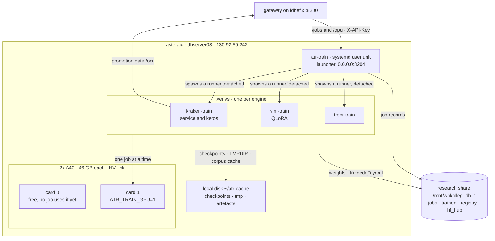

# training-atr-models

Training für ATR-Modelle — kraken, TrOCR und VLM-Feinabstimmung. Herausgelöst aus
[`serving-atr-inference`](https://github.com/thodel/serving-atr-inference) am
16.09.2026, läuft auf **asteraix** (130.92.59.242).

## Die Maschine

Beschrieben in zwei Dokumenten (englisch):

- [`docs/INFRASTRUCTURE.md`](docs/INFRASTRUCTURE.md) — asteraix im Detail: der
  Dienst und sein Launcher, die drei venvs, der Lebenslauf eines Jobs, was
  lokal und was auf dem Share liegt, die Karten, UBELIX.
- [`docs/OPERATIONS.md`](docs/OPERATIONS.md) — Deploy, Abbrechen und neu
  Einreichen, `.env` ändern, Logs, Registrierung von Hand, fremde Job-Einträge
  schliessen.

Das **Gesamtbild** beider Maschinen — idhefix, die Clients, alle Kanten, das
Share und die Werte, die auf beiden Maschinen übereinstimmen müssen — steht im
Serving-Repo:
[`docs/INFRASTRUCTURE.md`](https://github.com/thodel/serving-atr-inference/blob/main/docs/INFRASTRUCTURE.md).

## Warum getrennt

Bis zum Split liefen Serving und Training auf **einer** Maschine und teilten sich
**eine** Karte. Was das kostet, steht in einem Satz aus `docs/UBELIX_PLAN.md`:

> der Lauf `qwen3vl-german-pages-v3` hält ~30 GB, also startete vLLM mit 0,59 GB
> frei und starb. Das blockiert *jedes* Gateway-VLM, solange dieses Training läuft.

Auf asteraix stehen **zwei A40 à 46 GB** zur Verfügung, über NVLink verbunden
(4 Links à 14,06 GB/s, P2P aktiv) — statt der 31,6 GB, die ein Lauf sich auf
idhefix mit den Serving-Diensten teilte.

## Die Naht

Der Bot auf tei und der ATR-MCP sprechen weiterhin **ausschliesslich** den
Gateway auf idhefix an (`:8200`), der `/train/*` hierher durchreicht. Beide
ändern sich durch den Split nicht — und genau daran lässt sich ablesen, ob die
Trennung sauber ist.

Drei HTTP-Kanten, keine geteilte Python-Abhängigkeit:

| Kante | Richtung |
|---|---|
| `/train/*`-Proxy | idhefix → asteraix:8204 |
| Promotion-Gate | asteraix → idhefix:8200/ocr |
| `eval/` (kommt mit #11) | asteraix → idhefix:8200/recognize |

Die **Gewichte** queren gar kein Netz: beide Maschinen mounten
`/mnt/wbkolleg_dh_1`.

## Zugriff auf den Trainer (#13)

Der Trainer bindet an `0.0.0.0:8204`. Die ufw auf asteraix filtert hohe Ports
nicht, und niemand hat sudo für eine Quellregel — die Anwendung ist also die
einzige Sperre, und sie sperrt im Zweifel:

- Gestartet wird nur über `python -m atr_training.serve` (so auch die Unit). Der
  Launcher verweigert jeden Bind ausserhalb von Loopback (Exit 2), solange in der
  `.env` nicht alle drei stehen: `ATR_TRAIN_REQUIRE_AUTH` (Standard: an),
  `ATR_TRAIN_API_KEY` (mindestens 32 Zeichen, **derselbe Wert wie auf idhefix**,
  nicht der `ATR_API_KEY` des Gateways, #9) und `ATR_TRAIN_ALLOWED_CLIENTS`
  (`130.92.59.240`).
- Jede Route ausser `GET`/`HEAD /health` verlangt `X-API-Key`; Aufrufer ausserhalb
  von Loopback und Allowlist bekommen 403, ein Trainer ohne Schlüssel beantwortet
  nur `/health` (503). `/docs` und `/redoc` sind abgeschaltet.
- `/health` nennt `engines` und `available_engines`, `GET /gpu` liest die Karten
  **dieser** Maschine — der Gateway proxt beides (serving-atr-inference#137).

## Stand

Der Trainer läuft seit dem 16.09.2026 auf asteraix; was dort läuft, steht in
[`docs/INFRASTRUCTURE.md`](docs/INFRASTRUCTURE.md). Plan und Reihenfolge des
Umzugs:
[`docs/SPLIT_PLAN.md`](https://github.com/thodel/serving-atr-inference/blob/main/docs/SPLIT_PLAN.md)
im Serving-Repo, Epics ab #1.
