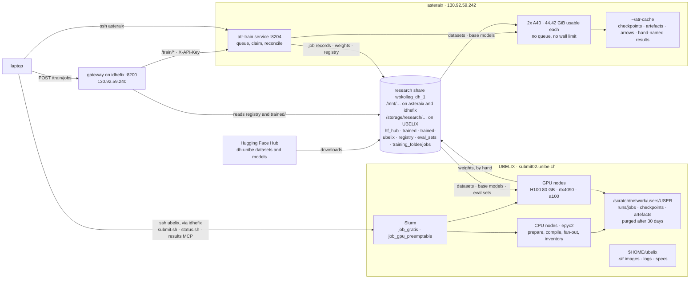

# asteraix and UBELIX, used together

State: written 10.10.2026 from the documents, scripts and issues this
repository holds on that day. Where a fact was measured, the date is given;
where it was not, it says so.

Training runs in two places. **asteraix** is our own box: two A40s, a service
(`atr-train`) that turns a request into a job and supervises it, no queue.
**UBELIX** is the university's Slurm cluster: H100s, a queue, no service of
ours. They are not alternatives for the same work. One run touches both when
it is a long training (UBELIX) that is measured, rescored or registered
afterwards (asteraix), and most of what makes that possible is that both mount
the **same research share**.

This document is the one place that says how the two fit together. What each
place is on its own is elsewhere, and this page does not repeat it:

| Question | Document |
|---|---|
| what runs on asteraix, how a job lives there, what is on local disk | [INFRASTRUCTURE.md](INFRASTRUCTURE.md) |
| how to submit, pin, resume and watch a Slurm job | [`ubelix/README.md`](../ubelix/README.md) |
| which place a new run should go to, and why | [WHERE_A_RUN_RUNS.md](WHERE_A_RUN_RUNS.md) |
| reading UBELIX results without a shell | [RESULTS_MCP.md](RESULTS_MCP.md) |
| the research share's contents and what may be deleted | [RESEARCH_STORAGE.md](RESEARCH_STORAGE.md) |
| deploy, cancel, register by hand, close a stuck record | [OPERATIONS.md](OPERATIONS.md) |
| the whole system with idhefix and the clients | serving-atr-inference [docs/INFRASTRUCTURE.md](https://github.com/thodel/serving-atr-inference/blob/main/docs/INFRASTRUCTURE.md) |

- [The picture](#the-picture)
- [Who does what](#who-does-what)
- [What the two places share](#what-the-two-places-share)
- [What they do not share](#what-they-do-not-share)
- [One run across both: a worked path](#one-run-across-both-a-worked-path)
- [A model's way from UBELIX to /models](#a-models-way-from-ubelix-to-models)
- [Comparing a number from each place](#comparing-a-number-from-each-place)
- [Seeing both from the laptop](#seeing-both-from-the-laptop)
- [What is still open](#what-is-still-open)

## The picture



Three things to read off it:

- **Nothing of ours talks from asteraix to UBELIX or back.** The laptop
  talks to both. asteraix reaches `submit02:22` (measured 05.10.2026) but has
  no key for the campus account, so the trainer cannot submit, watch or cancel
  a Slurm job ([#17](https://github.com/thodel/training-atr-models/issues/17)).
  Everything that crosses between the two places crosses **as files on the
  share**, moved by a person.
- **The share is the common ground, with a different path on each side.**
  `/mnt/wbkolleg_dh_1/…` on asteraix and idhefix, `/storage/research/wbkolleg_dh_1/…`
  on UBELIX, one filesystem. A path written into a record on one side does not
  open on the other side without translation.
- **The gateway on idhefix sees only asteraix.** `/train/*` is proxied to the
  service on asteraix. A UBELIX run is invisible to the gateway, to the Discord
  bot and to the ATR MCP, until its weights are registered from asteraix's side
  of the share.

## Who does what

The rule for a *new training* is in [WHERE_A_RUN_RUNS.md](WHERE_A_RUN_RUNS.md):
UBELIX by default, asteraix when the UBELIX wait would exceed 48 hours or the
run is a measurement rather than a training. This table is the result of that
rule plus the constraints that are not about waiting:

| Work | Place | Why, in one line |
|---|---|---|
| VLM training longer than a few hours (`vllm`) | UBELIX | an H100 is 1.8× the card, the queue is the price; preemptable runs chunk and resume by themselves |
| a fan-out of one prepared corpus into several arms (base-model ladders) | UBELIX | `ubelix/fanout.py` links the arms by symlink, which works on `/scratch` and not on the CIFS share; up to four H100s on the preemptable QoS |
| `prepare` and `compile` of a VLM corpus | UBELIX, **CPU node** | hours of streaming and cropping that touch no GPU; the two-stage path leaves the job in `training` and the GPU job resumes it |
| kraken training and `ketos compile` | **asteraix only** | no `ketos` on UBELIX, no container recipe, no arrows there ([#171](https://github.com/thodel/training-atr-models/issues/171)); at batch 256 a kraken run needs 43.5 GiB of an A40 and the card to itself (07.10.2026) |
| trocr training | UBELIX by the rule, never run anywhere yet | no measurement of its footprint exists ([#37](https://github.com/thodel/training-atr-models/issues/37)) |
| re-evaluations, rescoring a finished adapter, peak-memory and noise-floor measurements | asteraix | minutes to two hours, wanted the same day, and a walltime guess on UBELIX has already killed two rescorings ([#155](https://github.com/thodel/training-atr-models/issues/155)) |
| anything a client submits through the gateway (`POST /train/jobs`) | asteraix | the gateway proxies to the service there; nothing of ours submits to Slurm |
| registering a model, the promotion gate, serving | asteraix and idhefix | the registry has one writer, and a Slurm job never writes it |
| the daily training report | reads UBELIX | the results MCP probes the UBELIX job store over SSH; asteraix has nothing it can read ([#156](https://github.com/thodel/training-atr-models/issues/156)) |
| research-share inventory and the free-space check | UBELIX | `ubelix/storage_inventory.sbatch` weekly on a CPU node, `research_storage.py --check` daily |

Both A40s on asteraix are usable for training since 05.10.2026; nothing is
held free for urgent work any more. Something urgent displaces a run by hand.

## What the two places share

### The research share

One CIFS/GPFS filesystem, `wbkolleg_dh_1`, 12 T. Paths below are relative to
`Textrecognition_Training/` under the mount.

| Mount | Where |
|---|---|
| `/mnt/wbkolleg_dh_1` | asteraix and idhefix (CIFS 2.1 via autofs) |
| `/storage/research/wbkolleg_dh_1` | UBELIX login and compute nodes (GPFS `rs_gpfs`) |

| Path | Written by | Read by | Notes |
|---|---|---|---|
| `hf_hub/` | HF downloads from both sides | both | **two caches in one directory**, see below |
| `training_folder/jobs/` | the asteraix service and its runners | the asteraix service; any trainer | the shared job store. 53 job directories, 1.8 TB, no purge (09.10.2026). UBELIX jobs are **not** here |
| `training_folder/trained/MODEL_ID/` | the asteraix register stage | idhefix's engines, via `local_path` | the only place the gateway serves weights from |
| `registry/models.yaml`, `registry/trained/*.yaml` | the gateway (curated), the asteraix register stage and gate (trained) | the gateway; asteraix for the curated-id check | one writer per file; a Slurm job never writes here |
| `trained-ubelix/` | a person, copying from UBELIX scratch | a person, registering by hand on asteraix | 3.8 GB on 09.10.2026 |
| `eval_sets/german-medieval-v1/` | asteraix (`ketos compile`) | both | the durable copy of the held-out sets; kept outside the jobs tree on purpose ([EVAL_SETS.md](EVAL_SETS.md)) |
| `hub/` | an old `HF_HOME` | nobody today | 992 GB, the only local copy of one dataset; not a duplicate ([RESEARCH_STORAGE.md](RESEARCH_STORAGE.md)) |

The rules both sides follow on the CIFS side (no `chmod`, no symlinks, no
hardlinks, `copyfile` not `copy2`, tmp-then-`os.replace` in the same directory,
`O_CREAT|O_EXCL` is exclusive across hosts) are in the serving document. On the
GPFS side symlinks work, which is why `fanout.py` works on `/scratch` and would
not on `/mnt`.

**The Hugging Face cache is two caches, not one.** Both sides point into
`hf_hub/`, but not at the same level:

| Side | Setting | Cache directory | Form |
|---|---|---|---|
| asteraix | `HF_HOME` unset; `~/.cache/huggingface/hub` is a symlink to `hf_hub/` | `hf_hub/` itself: `hf_hub/models--*`, `hf_hub/datasets--*` | the "old form" of [RESEARCH_STORAGE.md](RESEARCH_STORAGE.md) §0 |
| UBELIX | `HF_HOME=…/Textrecognition_Training/hf_hub` | `hf_hub/hub/`: `hf_hub/hub/models--*`, `hf_hub/hub/datasets--*` | the current form |

So a dataset `prepare` downloaded on UBELIX is not found by a job on asteraix,
and the other way round. Both sides re-download what the other already holds.

On 09.10.2026 the old form under `hf_hub/` was deleted, 59 entries and 1.83 TB,
after a check that *the running software does not read those paths*. That check
was made on UBELIX, where it is true. On asteraix it is the cache the symlink
points at. **Measured on asteraix on 10.10.2026:**

```
$ readlink ~/.cache/huggingface/hub
/mnt/wbkolleg_dh_1/Textrecognition_Training/hf_hub
$ ls /mnt/wbkolleg_dh_1/Textrecognition_Training/hf_hub
CACHEDIR.TAG  datasets  hub  modules  xet
```

The link ends in `hf_hub`, and no `models--*` or `datasets--*` entry is left
at that level: `datasets`, `modules` and `xet` are what UBELIX's `HF_HOME`
creates, `CACHEDIR.TAG` is what asteraix's hub cache left behind. So every job
on asteraix now starts with a cold cache and refills the old form, which the
next storage pass would delete again. The fix is to point the symlink one level
down, at `hf_hub/hub/`, so that both sides read and write the same entries
([#207](https://github.com/thodel/training-atr-models/issues/207)). The rule
in [INFRASTRUCTURE.md](INFRASTRUCTURE.md#local-disk-or-the-share), *do not set
`HF_HOME` on asteraix*, is about bypassing the share; it does not say which
level inside the share the link should point at.

### The code

The same repository, the same `TrainRequest`, the same runner. A UBELIX job
runs `python -m vlm_train_svc.runner --root $ATR_TRAIN_JOBS_ROOT --job-id ID`,
exactly what the service on asteraix spawns. What differs is who writes the
record (`submit_job.py` on UBELIX, the service on asteraix) and who supervises
(Slurm there, the service here).

| | asteraix | UBELIX |
|---|---|---|
| checkout | `~/Repo/training-atr-models`; the unit and the installer require this path | `~/training-atr-models`; `ATR_TRAIN_REPO` overrides |
| what a run executes | the checkout as it is on disk, at every stage start; a `git pull` during a run changes its later stages | a git worktree of the commit `submit.sh` pinned at submission, one per commit and node; a pull during the queue changes nothing |
| deploy | `git pull`, then restart the unit; compare the stage files against the run's commit first ([OPERATIONS.md](OPERATIONS.md#deploy)) | `git pull` on the login node; the next `submit.sh` pins the new HEAD. `submit.sh` refuses a checkout behind `origin/main` or with uncommitted changes |
| Python and engines | three venvs under `.venvs/`, built by `scripts/make_venvs.sh` against driver 580.95.05 | Apptainer images in `$HOME/ubelix/`: `vlm-train.sif` (transformers 4.x, the repo's pins) and `vlm-train-tf5.sif` (transformers 5.x, for Gemma 4, Qwen3.5 and Qwen3.8); the venv inside is `/opt/vlm-train`, so `ATR_TRAIN_VENVS_ROOT=/opt` |
| the request | the JSON body of `POST /train/jobs` | the same JSON, as a file in `~/ubelix/specs/`, read by `submit_job.py` |

A spec written for one side runs on the other. `plan_corpus.py` writes the
same file for both.

### Hugging Face as source and sink

Both sides download the `dh-unibe/image-text_*` datasets and the base models
from the Hub, and both upload only to private repos under `dh-unibe`. The HF
token is private on both sides: in `.env` on asteraix, in `~/.hf_token` on
UBELIX, never under `HF_HOME` on the share, which the whole group can read.
UBELIX compute nodes have internet, so corpora need no pre-caching, but a GPU
node could not fetch base weights on its own in one measured case (job
16191716), so `prefetch_bases.sh` runs as a CPU job first. That script lives
on UBELIX only and has never been committed.

## What they do not share

| | asteraix | UBELIX | Consequence |
|---|---|---|---|
| job store | `training_folder/jobs/` on the share, written by the service. A hand-run measurement (`scripts/measure_*.py`) writes no record at all, only hand-named JSON under `~/atr-cache/` | `/scratch/network/users/$USER/runs/jobs/` (experiments: `$SCRATCH/expA/jobs` …), purged after 30 days | no reader sees both. The results MCP reads UBELIX; `GET /train/jobs` lists asteraix's store. A number from asteraix has to be noted by hand wherever it is quoted ([#156](https://github.com/thodel/training-atr-models/issues/156)) |
| `host` on a record | `asteraix` | `ubelix`, stamped by `submit_job.py` and `fanout.py` | the rules for `host: ubelix` in the service (never start, judge or cancel; 409 with a pointer to `scancel`) only apply once a UBELIX record is in the shared store, which none is today |
| checkpoints | `~/atr-cache/checkpoints/` | `$SCRATCH/runs/checkpoints/` | a resume is only possible where the checkpoint is; a run cannot move between the places mid-way |
| compiled corpora (artefact cache) | `~/atr-cache/artefacts/`, 100 GB budget | `$SCRATCH/expA/artefacts/`, shared by every sbatch file | the same selection is compiled once per side. A two-stage UBELIX job *claims* its entry so that stage 2 still finds it days later |
| kraken arrows | `~/atr-cache/arrows/` | none | kraken trains on asteraix only ([#171](https://github.com/thodel/training-atr-models/issues/171)) |
| GPU index | `ATR_TRAIN_GPU=1`, physical, the child sees `cuda:0` | `ATR_TRAIN_GPU=0`, Slurm's allocated card | copy a header from `ubelix/smoke.sbatch`, not from `.env` |
| what SIGTERM means | cancel: the job becomes `cancelled` | with `ATR_TRAIN_PREEMPTABLE=1`, a preemption: the job stays `training` and the runner exits 75 for a requeue | a scancelled preemptable job stays live in its record until someone closes it |
| the registry | the register stage writes `trained/ID.yaml` and runs the gate | a Slurm job (`SLURM_JOB_ID` set) writes weights and `metadata.json` and only *reads* the registry | see the next two sections |
| wall limit and interruption | none | 96 h on `job_gratis`, 24 h and preemption on `job_gpu_preemptable` | a 70-hour run on the preemptable QoS pays the queue three times ([WHERE_A_RUN_RUNS.md](WHERE_A_RUN_RUNS.md) §4) |
| the GPU as a shared resource | nobody else; but a colleague's process on a card raises `card_mib` and can push a kraken run over the edge | the card is the job's alone | asteraix's VRAM check at start is the only guard there |

## One run across both: a worked path

The base-model ladder of
[BASE_MODEL_LADDER.md](BASE_MODEL_LADDER.md) is the shape most of our runs
have taken since September. Each step names the place it happens.

1. **Plan the corpus, on the laptop or a login node.** `scripts/plan_corpus.py`
   writes one spec JSON. The same file would be the body of `POST /train/jobs`
   on asteraix.
2. **Stage 1 on a UBELIX CPU node.** `ubelix/submit.sh ubelix/prepare.sbatch
   ~/ubelix/specs/<name>.json`. `submit_job.py` writes the record, stamped
   `host: ubelix`, into `$SCRATCH/runs/jobs`; the runner streams the pages from
   the Hub (into `hf_hub/hub/` on the share), cuts the split with the seed, and
   stops after `compile`. The job is left in `training`.
3. **Fan out, on the login node.** `ubelix/fanout.py` clones the prepared job
   into one arm per base model. The arms share the corpus and the draw by
   symlink on `/scratch`.
4. **Stage 2 on an H100.** One `ubelix/submit.sh ubelix/train.sbatch` per arm,
   `job_gratis` when one H100 and 96 hours are enough, otherwise the preemptable
   QoS with `train_resumable.sbatch`. Each arm takes the ordinary resume path,
   trains, tests, and writes its weights to `$SCRATCH/runs/trained/<id>`. The
   register stage writes `metadata.json` and a `registration` note saying how
   to register by hand, and the job ends `completed` with `promoted: false`.
5. **Read the results, from the laptop.** `results()`, `draw()` and `job()` of
   the results MCP, or `ubelix/status.sh`. This is where the comparison of the
   arms is made, and this is the only place it can be made today.
6. **Measure what the queue cannot, on asteraix.** A rescoring on another
   arm's draw (`ubelix/rescore_on_shared_draw.py` works on either side), a
   granularity evaluation, a peak-memory sample: hours, no walltime, no queue.
   The adapter has to be where the script runs, so it is copied from
   `$SCRATCH` to the share first. The result is a JSON file somebody names by
   hand.
7. **Register the winner, from asteraix.** The next section.
8. **Before the 30 days are up,** `deadlines()` says which scratch directories
   are about to be purged. Weights that are going to be served belong on the
   share or on the Hub by then.

## A model's way from UBELIX to /models

Today this is a hand procedure, and every step of it is on the asteraix side
of the share. The decision of 16.09.2026 stands: **asteraix registers**, so
that the registry has one writer, running where the same-filesystem check
of the register stage is valid. The Slurm job never writes `registry/`.

1. **On UBELIX:** read the registration note, which names the weights and the
   YAML to write.

   ```bash
   python3 -c "import json,sys; print(json.load(open(sys.argv[1]))['registration'])" \
       /scratch/network/users/$USER/runs/jobs/<job-id>/job.json
   ```

2. **On UBELIX:** copy the weights directory to the share, under
   `trained-ubelix/<model_id>/`. For the gateway it must end up under
   `training_folder/trained/<model_id>/`, because idhefix's engines open the
   `local_path` the registration names, under `/mnt/…`. `trained-ubelix/` is
   the staging area; move or copy into `trained/` from asteraix, so that the
   write happens on the filesystem the registration will name.
3. **A VLM adapter has to be merged first.** vLLM 0.11 on idhefix cannot
   serve an adapter that touches the vision tower, so `scripts/merge_loras.py`
   in the serving repo turns adapter plus base into full weights. A kraken
   model needs no such step, and no kraken model has come from UBELIX yet.
4. **On asteraix:** write `registry/trained/<model_id>.yaml` with the `/mnt/…`
   path, `enabled: false`, through `atr_training.registration` as in
   [OPERATIONS.md](OPERATIONS.md#registering-by-hand). Translate every path
   in the note from `/storage/research/…` to `/mnt/…` before pasting it.
5. **On asteraix:** promote by hand ([OPERATIONS.md](OPERATIONS.md#promoting-by-hand)).
   The automatic gate runs only inside a kraken job's register stage, so a
   model trained on UBELIX never meets it.
6. The gateway reads `trained/` at its next look, at most every 5 s, and the
   model appears in `GET /models`.

The record on UBELIX never learns that this happened. Its `promoted: false`
stays, and the `registration` note is the only link between the Slurm job and
the registered model. Until [#17](https://github.com/thodel/training-atr-models/issues/17)
gives asteraix a Slurm watcher that registers a finished UBELIX job itself,
write the job id into the registration's comment lines.

## Comparing a number from each place

Two CERs are comparable only on the same draw, and the draw is a per-job file.

- **The draw** is `data/val_eval.jsonl` in the job directory. Two arms of a
  fan-out share it by symlink, but a job that adopted a cached artefact can
  still stratify a different subset, because `_eval_subset` reads counts that
  belong to the job and not to the corpus (measured 04.10.2026). `draw(job_id)`
  of the results MCP gives the md5 and every job that shares it.
- **Rescoring on a shared draw** puts two runs on one draw after the fact:
  `ubelix/rescore_on_shared_draw.py --job <scored> --draw-from <reference>`.
  It reads the adapter from the record's `checkpoint_dir`, scores it on the
  other job's draw with the scored run's own base, pixel and sequence budget,
  and writes `data/eval_report.<reference>.json` beside the run's own report.
  It touches no record. It runs on UBELIX (`rescore_on_shared_draw.sbatch`,
  an rtx4090 on `job_gratis`) or on asteraix, with `ATR_TRAIN_JOBS_ROOT`
  pointing at a copy of both job directories.
- **The kraken held-out sets** are the durable exception: compiled once on
  asteraix, kept on the share under `eval_sets/`, and rebuilt from document
  ids with `scripts/restore_eval_split.py` when lost. The medieval kraken
  numbers in this repository are on `german-medieval-v1`.
- **Which container or venv measured a CER is recorded nowhere**
  ([#206](https://github.com/thodel/training-atr-models/issues/206)). Two
  numbers from the two places were measured by different builds of
  `transformers` and torch. Until the record says which, note it by hand next
  to the number.
- **The A40-to-H100 throughput ratio** on identical work is unmeasured
  ([#162](https://github.com/thodel/training-atr-models/issues/162)). Wall-clock
  numbers from the two places are not comparable at all; step counts and
  seconds per step are, once that ratio exists.

## Seeing both from the laptop

| Route | Goes through | Needs |
|---|---|---|
| `ssh asteraix` | direct | VPN |
| `ssh ubelix` | `srv-train`, which is the SSH alias of **idhefix** (not of asteraix, despite the name; do not rename it) | no VPN; dies when idhefix is down |
| `ssh ubelix-direct` | direct to `submit02` | VPN |
| `GET /train/gpu`, `/train/jobs` on the gateway, the Discord `/atr_gpu` and `/atr_jobs` commands | idhefix, proxied to asteraix | the gateway's key |
| the results MCP (`atr-results`) | `ubelix`, then `ubelix-direct`, over SSH with the probe on stdin | the campus SSH key; runs on the laptop today |

Two commands answer "where should the next run go" in a minute, both from
[WHERE_A_RUN_RUNS.md](WHERE_A_RUN_RUNS.md) §6:

```bash
ssh ubelix "squeue -u \$USER --start -o '%.10i %.20S %.8Q'; sinfo -h -o '%N %t %G %C' -p gpu | grep h100"
```

```bash
ssh asteraix "nvidia-smi --query-gpu=index,memory.total,memory.used,utilization.gpu --format=csv,noheader"
```

For the daily report, `queue()`, `finished(days)` and `deadlines()` of the
results MCP replace the first of those. There is no equivalent for asteraix:
its service answers `/health` and `/gpu` through the gateway, and its hand
runs answer nothing.

## What is still open

In the order in which closing them changes this page:

| Issue | What it would change here |
|---|---|
| [#17](https://github.com/thodel/training-atr-models/issues/17) | the trainer on asteraix submits to Slurm, watches the job, cancels with `scancel`, and **registers the result itself**. "A model's way from UBELIX to /models" becomes automatic, and a dead UBELIX job no longer stays live |
| [#156](https://github.com/thodel/training-atr-models/issues/156) | asteraix gets the same job store as UBELIX, so that one probe reads both and a measurement on asteraix has a record |
| [#171](https://github.com/thodel/training-atr-models/issues/171) | a `kraken-train.def` and arrows on UBELIX; kraken stops being asteraix-only, and the batch sweep that says where its headroom is can run |
| [#162](https://github.com/thodel/training-atr-models/issues/162), [#163](https://github.com/thodel/training-atr-models/issues/163) | the A40-to-H100 ratio and the peak-memory table turn the placement rule from a judgement into arithmetic |
| [#206](https://github.com/thodel/training-atr-models/issues/206) | the record says which container measured a CER, so a number from each place carries its provenance |
| [#12](https://github.com/thodel/training-atr-models/issues/12) | a card per job on asteraix, two runs at once; and the only path on which asteraix holds something an H100 cannot (80 to 88.8 GiB) |
| [#150](https://github.com/thodel/training-atr-models/issues/150) | the preemption log line says what actually happens |
| [#207](https://github.com/thodel/training-atr-models/issues/207) | asteraix's symlink moves to `hf_hub/hub/`: one cache for both sides instead of two in one directory ([above](#the-research-share)) |
