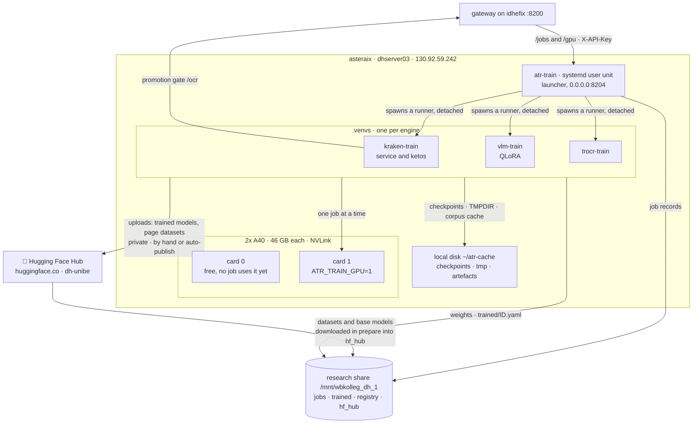
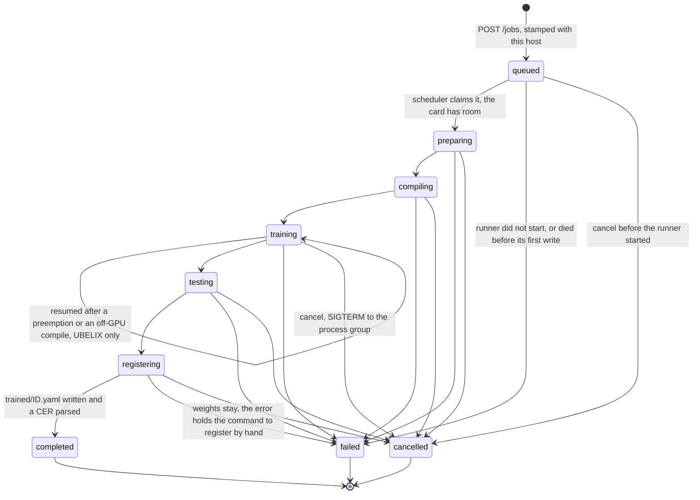

# asteraix, the training machine

State: measured on 16.09.2026, the day training moved here.

This document describes the machine this repository deploys to: what runs on
it, how a job lives, and what is kept on local disk or on the share. It does
not describe the whole system. idhefix (serving), the clients, all network
edges, the share layout and the values both machines must agree on are in
serving-atr-inference's
**[docs/INFRASTRUCTURE.md](https://github.com/thodel/serving-atr-inference/blob/main/docs/INFRASTRUCTURE.md)**.
This document links to it and does not copy it.

For procedures (deploy, triage, cancel, `.env` edits, logs, registering and
promoting by hand), see
[OPERATIONS.md](OPERATIONS.md).

- [The machine at a glance](#the-machine-at-a-glance)
- [The host](#the-host)
- [The service: atr-train](#the-service-atr-train)
- [The venvs](#the-venvs)
- [Network and trust](#network-and-trust)
- [The life of a job](#the-life-of-a-job)
- [From a trained model to /models](#from-a-trained-model-to-models)
- [Local disk or the share](#local-disk-or-the-share)
- [The cards](#the-cards)
- [Values shared with idhefix](#values-shared-with-idhefix)
- [UBELIX](#ubelix)
- [Deploying and restarting](#deploying-and-restarting)

## The machine at a glance

- The service **supervises and does not train**. Each job runs as a detached
  child process in its engine's venv, so a restart of the service does not
  stop a run.
- Only kraken jobs call back to the gateway. The promotion gate exists for
  kraken only (see [below](#from-a-trained-model-to-models)).
- The handover to serving is **two files on the share**: the weights directory
  and `registry/trained/ID.yaml`. No network call hands a model over.
- **Hugging Face is the only outside source and sink of data.** `prepare`
  downloads the `dh-unibe/image-text_*` datasets and the base models into the
  shared cache `hf_hub/` (the symlink behind `~/.cache/huggingface/hub`), so a
  second job, the other machine and UBELIX reuse them. Uploads go the other way
  and are always private repos under `dh-unibe`: trained models through the
  runner's auto-publish (off unless `ATR_TRAIN_AUTO_PUBLISH_MIN_ACCURACY` is set)
  or by hand with `scripts/publish_to_hub.py`, page datasets built from TEI
  editions with `scripts/tei_edition_to_hf.py`. Both scripts still live in
  serving-atr-inference and move here with #6; they run in the `kraken-train`
  venv, which has `huggingface_hub`.

## The host

| | asteraix |
|---|---|
| IP | 130.92.59.242 |
| `hostname` | `dhserver03` (`dhserver03.wbkolleg.unibe.ch`), not used as an identity (see below) |
| Role | training: `atr-train` supervises runs; nothing is served for clients here |
| SSH alias (laptop) | `asteraix` |
| OS / kernel | Ubuntu 24.04.3 / 6.14.0-37 |
| CPU / RAM | AMD Threadripper PRO 5965WX, 48 threads / 251 GB |
| GPUs | 2x NVIDIA A40, 46068 MiB each, NVLink NV4 with P2P working, driver 580.95.05 |
| Disk `/` | 1.8 T, 74 % used |
| Python | 3.12.3 (CI tests on 3.12 to match) |
| sudo / linger | no passwordless sudo / linger on, so user units run without a login and start at boot |
| Firewall | ufw is active but **does not filter high ports**, and nobody has sudo to add a rule |
| Listening | `0.0.0.0:8204` (atr-train), `:22`, `:111`, `127.0.0.1:631` |
| Checkout | `~/Repo/training-atr-models`. The unit and `scripts/install_user_unit.sh` require this path |

**Names.** Jobs are stamped with `ATR_TRAIN_HOST_ID=asteraix`, not with the
hostname. The hostnames (`dhserver03` here, `srv` on the serving box) are no
identity (#15). Older serving documents use the name "asterAIx" for the serving
box. That box is idhefix, 130.92.59.240 (serving-atr-inference#136).

## The service: atr-train

| Unit | Port | Bind | venv | KillMode |
|---|---|---|---|---|
| `atr-train.service` | 8204 | `0.0.0.0` | `kraken-train` | `process` |

Source: [`deploy/systemd/atr-train.service`](../deploy/systemd/atr-train.service),
a systemd **user** unit. `bash scripts/install_user_unit.sh` installs it to
`~/.config/systemd/user/`.

| Setting | Value, and why |
|---|---|
| `ExecStart` | `.venvs/kraken-train/bin/python -m atr_training.serve --host 0.0.0.0 --port 8204`. The bind is set in the unit, not in `.env`, so widening it requires a change in git |
| `WorkingDirectory` | `~/Repo/training-atr-models/engines` |
| `EnvironmentFile` | `~/Repo/training-atr-models/.env`, read at start only |
| `Environment` | `PYTHONPATH=…/src`. The runners inherit it, and nothing else puts `src/` on their path |
| GPU | none for the service itself. Each job gets `CUDA_VISIBLE_DEVICES` from `ATR_TRAIN_GPU` |
| `Restart` | `on-failure`, after 5 s |
| `RestartPreventExitStatus=2` | exit 2 means the launcher refused the configuration, and restarting every 5 s would bury the line that says why |
| `KillMode=process` | a restart stops the service and leaves its runners alone (see below) |
| `WantedBy` | `default.target`. With linger on, the unit starts at boot |

**The launcher (#13).** The service is started by `python -m atr_training.serve`,
not by uvicorn directly. The launcher refuses any bind beyond loopback (exit 2)
unless `.env` holds all three of: `ATR_TRAIN_REQUIRE_AUTH` (default true), an
`ATR_TRAIN_API_KEY` of at least 32 characters, and a non-empty
`ATR_TRAIN_ALLOWED_CLIENTS`. The refusal names each missing setting, never the
key. `--check` gives the verdict without starting anything, and
`install_user_unit.sh` runs it before copying the unit. The launcher exists
because this box's ufw does not filter high ports: on 16.09.2026 a test listener
on :8299 was reached from idhefix **and** from a VPN client. The application is
therefore the only barrier. A service that refuses to start is safer than one
that starts open and refuses each request.

**Access on every request** (`src/atr_training/access.py`), in this order:

1. The source is the socket peer, never a header (uvicorn's `X-Forwarded-For`
   rewriting is off). Loopback is always allowed. Anything else must be in
   `ATR_TRAIN_ALLOWED_CLIENTS`, otherwise the answer is **403**.
2. `GET`/`HEAD /health` needs no key.
3. With no key configured, everything else gets **503**. A non-loopback caller
   also gets 503 while the settings would fail the launcher's check.
4. A missing or wrong `X-API-Key` gets **401**. The gateway turns 401 and 403
   into a 502 that names the setting to fix. `/docs` and `/redoc` are off.

**Why `KillMode=process`.** A runner is spawned with `start_new_session=True`,
which gives it its own process group but leaves it in the unit's cgroup.
systemd's default (`control-group`) kills the whole cgroup on stop or restart.
The runner's signal handler would then mark the job `cancelled on request`,
although nobody had cancelled it. This happened on idhefix on 07.08.2026: a
deploy restarted the unit 20 minutes into a compile and killed a run that had
already spent 2.5 hours in prepare. With `KillMode=process` it held on
15.09.2026: the unit was restarted during v4's prepare, and the runner carried
on for twelve more minutes.

**Endpoints** (`engines/kraken_train_svc/app.py`). The gateway proxies the job
routes and `/gpu` under `/train/*` (`POST /train/jobs`, `/train/jobs/{id}/cancel`,
…). It does not proxy `/jobs/verify` or `/health`. The gateway's own `/health`
calls the trainer reachable for any answer below 500. A wrong key or a missing
allowlist entry therefore still reads as reachable there; only an authenticated
`/train/*` call tests them ([OPERATIONS.md](OPERATIONS.md#health)).

| Route | Does |
|---|---|
| `POST /jobs` | submit, returns 202 with `job_id`; `?verify_only=true` only checks the request |
| `POST /jobs/verify` | check a dataset spec, queue nothing |
| `GET /jobs`, `GET /jobs/{id}` | all records (every host's), one record |
| `GET /jobs/{id}/log?stage=…&lines=…` | tail a stage log (default `train`, 200 lines, at most 5000) |
| `GET /jobs/{id}/curve` | per-epoch metrics, read live from the checkpoints while training |
| `POST /jobs/{id}/cancel` | SIGTERM to the process group, for this host's jobs only |
| `DELETE /jobs/{id}` | drop the artefacts of a terminal job of any host; `job.json` and the registered model stay, and only this host's checkpoints are removed |
| `GET /gpu` | this machine's cards, every process on them, and which job it belongs to |
| `GET /health` | liveness, which engines have a venv, the cards, job counts over the whole store; the only route without a key |

## The venvs

The engines need dependency trees that cannot be combined. kraken 7.0.2 needs
`datasets<4`, and the VLM trainer needs a `transformers` new enough for
Qwen3-VL. The TrOCR trainer pins `transformers` differently again. Each engine
therefore has its own venv, and the service imports none of them: it starts
each job with that engine's interpreter (`src/atr_training/backends.py`). A
broken VLM venv therefore cannot stop kraken jobs.

| venv | Engine (`engine` in a request) | Runner | Notes |
|---|---|---|---|
| `kraken-train` | `kraken` | `kraken_train_svc.runner` | also runs **the service** (it carries fastapi and uvicorn) and provides `ketos` |
| `vlm-train` | `vllm` | `vlm_train_svc.runner` | QLoRA on Qwen3-VL; train and eval run as `python -m vlm_train_svc.train_qlora` / `evaluate_qlora` |
| `trocr-train` | `trocr` | `trocr_train_svc.runner` | train and eval run as `python -m trocr_train_svc.train_trocr` / `evaluate_trocr` |

All three use Python 3.12.3 and torch 2.8.0+cu128. They live in `.venvs/`.
Jobs look for them under `ATR_TRAIN_VENVS_ROOT` if that is set, and both
scripts read the same key. The unit always starts the service from
`.venvs/kraken-train`.

- **Build:** `bash scripts/make_venvs.sh [venv …]`. It installs torch first from
  the cu128 index. With the default index, pip picks a wheel built for the
  newest CUDA, and a GPU job then falls back to the CPU without failing. If
  `TMPDIR` is on a network filesystem, the script switches to a local one: pip
  cannot replace an installed package there. On idhefix on 07.08.2026,
  `pip install -U pip` died with EPERM that way. The script installs into an
  existing venv in place.
- **Check:** `bash scripts/check_venvs.sh [-v]`. It checks imports and compares
  installed versions against each `requirements.txt`. Imports alone are not
  enough: `transformers` 5.14.1 passed every import against code written for
  4.57, and so did the repair that failed with EPERM.
  `tests/test_venv_scripts.py` checks that the backends, the build list and the
  check list name the same three venvs.
- A missing venv is reported at submit (503, with the build command) rather
  than as a failed job hours later. `/health` lists `available_engines`.

## Network and trust

This host's edges. The complete list for both machines is in the serving
document.

| Direction | Purpose | Authentication | Setting here |
|---|---|---|---|
| idhefix gateway → here, `:8204` | `/train/*`: submit, read, cancel jobs; `/train/gpu` | `X-API-Key` = `ATR_TRAIN_API_KEY`, the same name and value on both hosts; source must be in the allowlist | `ATR_TRAIN_API_KEY`, `ATR_TRAIN_ALLOWED_CLIENTS=130.92.59.240` |
| here → idhefix gateway, `:8200/ocr` | promotion gate, one held-out page | `X-API-Key` = idhefix's `ATR_API_KEY`, plus the header `X-ATR-Promotion-Gate: 1` | `ATR_TRAIN_GATEWAY_URL`, `ATR_TRAIN_GATEWAY_API_KEY` |
| here → idhefix gateway, `:8200/recognize` | `eval/`, **planned** with #11 | as above | as above |
| here ↔ share | job records, weights, registry, HF cache | filesystem | `ATR_TRAIN_JOBS_ROOT`, `ATR_TRAIN_TRAINED_ROOT`, `ATR_TRAIN_REGISTRY_ROOT` |
| here → UBELIX `submit02.unibe.ch:22` | **planned** with #17: submitting and watching Slurm jobs | a dedicated key, not yet installed | none yet |

**Two keys (#9).** `ATR_TRAIN_API_KEY` controls this machine: it can start
multi-day runs. `ATR_API_KEY` is the gateway's inference key. The two must
differ, so that a leaked caller key cannot start training runs. This service
never reads a variable called `ATR_API_KEY`: it holds the gateway's key under
the name `ATR_TRAIN_GATEWAY_API_KEY`.

**What protects :8204:** the allowlist (the gateway's IP only), the key, and
the launcher that refuses to start without both. ufw does not filter the port,
and nobody has sudo to add a rule. How the gateway handles this edge (20 s read
timeout, 5 s connect, 504 on timeout, 502 on 401/403) is described in the
serving document.

## The life of a job

The diagram draws every transition the code allows (`TRANSITIONS` in
`src/atr_training/jobstore.py`, statuses from `contracts.JobStatus`), and a
test keeps the two in step. Terminal statuses have no way out: a `failed` or
`cancelled` job is never restarted. A new submission is a new job.

| Status | Stage running | Written by |
|---|---|---|
| `queued` | none; `queued_reason` says what it waits for | the service at submit |
| `preparing` | `prepare`: stream pages from the hub, cut the split | the runner |
| `compiling` | `compile`: kraken runs `ketos compile` to `.arrow`; VLM and TrOCR write line crops or pages and a `.jsonl` | the runner |
| `training` | `train` | the runner |
| `testing` | `test`: score the model, a CER is required | the runner |
| `registering` | `register`: weights to the share, then `trained/ID.yaml` | the runner |
| `completed` | none; only with a parsed CER | the runner |
| `failed` | none; always with a reason in `error`, and `log_tail` (the last 50 log lines) when a log exists | the runner; the service when a runner is gone; a person with `close_job` for another host's job |
| `cancelled` | none | the runner on SIGTERM; the service for a job that never started; a person with `close_job` for another host's unstarted job |

**Scheduling.** Every 10 s (`ATR_TRAIN_POLL_INTERVAL_S`), and right after each
submit, the service reconciles the records. It then starts the **oldest**
queued job of this host, provided no other job of this host runs
(`ATR_TRAIN_MAX_CONCURRENT=1`) and card `ATR_TRAIN_GPU` has enough free memory:
12000 MB for kraken and TrOCR, 24000 MB for VLM. A smaller job never jumps the
queue, because that would starve exactly the expensive runs the queue exists
for. Before spawning, the scheduler creates `jobs/ID/spawn.claim` with
`O_CREAT|O_EXCL`. That call is exclusive across both hosts on the share
(measured), so a job is started once even with two schedulers. A claim without
a runner pid after 10 minutes fails the job with an explanation.

**Refused at submit** (so it does not fail hours later): no venv for the
engine (503); less than 50 GB free in the job store (507); a `base_model` that
does not resolve (400); a `TMPDIR` on a network filesystem (500); a datasets
cache on a network filesystem while `ATR_TRAIN_CACHE_DATASETS` is on (500); a
dataset spec the hub contradicts (400); a live job of **any** host with the same `model_id`
(409); a `model_id` that is a curated id (409). An unreachable hub does not
block the queue: the job is accepted, and the answer says
`dataset_verified: false` with the reason.

**What happens when …**

| Event | Result |
|---|---|
| `POST /jobs/{id}/cancel`, job not started | the cancel takes the claim, and the job becomes `cancelled` ("cancelled before it started"). If a scheduler is starting it at that moment, the answer is 409: ask again in a few seconds |
| `POST /jobs/{id}/cancel`, job running | SIGTERM to the runner's process group (the runner and its trainer subprocess). The runner writes `cancelled` ("cancelled on request") |
| `systemctl --user restart atr-train` | the runner keeps going (`KillMode=process`). At startup the service reconciles: a live pid is left alone |
| the runner dies (OOM, crash) or the machine reboots | the next reconcile marks the job `failed`: "runner process N is gone while the job was …; see logs/ in the job directory". After a reboot the unit starts again by itself (linger) |
| a stage raises | `failed`, with the stage and the exception in `error` and the tail of the stage log in `log_tail`. A failed VLM train stage also says which checkpoint or adapter survived |
| a deploy during a run | the run continues, but it later reads code **from disk**: stage scripts start as new processes (`python -m vlm_train_svc.evaluate_qlora`), and imports inside functions (auto-publish) happen when they run. Compare those files against the commit the run started from **before** deploying ([OPERATIONS.md](OPERATIONS.md#deploy)) |
| the gateway on idhefix restarts, or idhefix is down | the run continues: nothing here needs the gateway before the promotion gate. A kraken gate that falls in that window gets a connection error or a timeout, and the gate does not retry either (it retries only `404 unknown model`). The job still ends `completed`, with `promoted: false` and the error in `promotion_reason`, and the model stays registered but disabled until someone [promotes it by hand](OPERATIONS.md#promoting-by-hand) |

**Ownership (#15).** The job store is on the share, and a pid only has a
meaning on the machine that issued it. Before #15, two trainers on one store
each checked the other's pids against their own `/proc` and marked running jobs
failed. Therefore:

- The service that accepts a job stamps its `ATR_TRAIN_HOST_ID` into the record
  (`host`).
- A record without `host` belongs to `ATR_TRAIN_LEGACY_JOB_HOST` (default
  `idhefix`). On 16.09.2026 the shared store held 51 records: 48 legacy ones
  from the old trainer on idhefix, and 3 stamped `asteraix`.
- `host: ubelix` means Slurm supervises the job, and **no** trainer owns it
  (see [UBELIX](#ubelix)). A trainer may not call itself `ubelix`.
- Reconcile, spawn, cancel and the attribution in `/gpu` act on this host's
  jobs only. `DELETE` removes the artefacts of a terminal job of any host, but
  only this host's checkpoints: another host's checkpoints are on that host's
  local disk. For a live job of another host, cancel and `DELETE` answer
  **409**, naming the host and the command that closes the record by hand
  (`python -m atr_training.close_job`, [OPERATIONS.md](OPERATIONS.md#closing-another-hosts-stuck-record)).
- Every host's jobs are listed and readable. A `model_id` clash counts across
  hosts, because the weights directory and the registry are shared.

The old in-repo trainer on idhefix has none of these protections. It stays
retired (disabled on 16.09.2026, its unit file removed from the serving
installer). It must never run against this store again: it would mark this
host's running jobs failed, start any queued job it sees, and its `DELETE`
would remove weights that another host is still registering.

**Orphaned weights.** At startup and after each `DELETE`, the service removes a
directory under `trained/` only if **all** of these hold: it has no
`metadata.json`; nothing in it changed for 24 h
(`ATR_TRAIN_ORPHAN_WEIGHTS_MIN_AGE_H`); no live job of any host names it; and
no registration names it. A registration in progress on the other machine looks
exactly like an orphan until its `metadata.json` is written.

## From a trained model to /models

The trainer's side of the handover. The gateway's side (reload, serving) is in
the serving document.

1. **`register`** copies the weights to
   `training_folder/trained/MODEL_ID/`. It uses `copyfile`, not `copy2`,
   because copying mode and times is EPERM on the share. `metadata.json` is
   written next, and `registry/trained/MODEL_ID.yaml` last, with
   `enabled: false`. The YAML is written as a tmp file in the same directory
   and then `os.replace`d, and the file name equals the id.
2. Before any byte is copied, the runner refuses two cases. A `model_id` that
   is a curated id: the gateway skips such a file and would answer the gate
   with the curated model's weights. And an existing registration of the same
   id that cannot be read or disabled: retraining an existing id always
   disables the old registration before replacing its weights.
3. The weights must be on the **same filesystem** as the registry. With a
   local `ATR_TRAIN_TRAINED_ROOT`, idhefix could not open the `local_path`, so
   such a job fails.
4. **If the registration cannot be written**, the job fails with "the model is
   trained but NOT registered". The weights stay, and `error` contains a
   command that registers the model by hand (#14,
   [OPERATIONS.md](OPERATIONS.md#registering-by-hand)). Between the split and
   #14, every registration went into a file the gateway never read, and the
   jobs still read `completed`.
5. **The promotion gate** (after the stage; a failed gate never fails the job):

   | Engine | Gate |
   |---|---|
   | kraken | posts the first held-out validation page to `ATR_TRAIN_GATEWAY_URL/ocr` with `X-ATR-Promotion-Gate: 1`. That header lets the gateway serve this still-disabled registration to the gate only. Non-empty text rewrites **only** `enabled` to `true` in that one file. The gateway reads `trained/` at most every 5 s, and CIFS attribute caching adds a delay, so the first request always gets `404 unknown model`. The gate asks again every 10 s for up to 90 s (`ATR_TRAIN_GATEWAY_REGISTRY_RETRY_S`, `…_WAIT_S`). Any other failure is not retried. Without `ATR_TRAIN_GATEWAY_API_KEY` it does not run |
   | vllm | never promotes here: vLLM 0.11 cannot serve an adapter that touches the vision tower, so it has to be merged first with `scripts/merge_loras.py` in the serving repo |
   | trocr | no gate in this repo; the model stays registered but disabled |

   A model that the gate did not promote stays registered but disabled: every
   trocr and vllm model, and a kraken model whose gate failed. It reaches
   `/models` only when someone promotes it by hand
   ([OPERATIONS.md](OPERATIONS.md#promoting-by-hand)), a vllm model only after
   the merge.

6. The gateway picks up the rewritten file without a restart, and the model
   appears in `GET /models`. `promoted` and `promotion_reason` on the job record
   say what happened.

Optional afterwards: publishing to the Hub when the character accuracy reaches
`ATR_TRAIN_AUTO_PUBLISH_MIN_ACCURACY`. The default of 0 disables it. The repos
it creates are always private.

## Local disk or the share

The share is `//resstore.unibe.ch/wbkolleg_dh_1`, mounted with CIFS 2.1 via
autofs at `/mnt/wbkolleg_dh_1` on both machines. It has 12 T, 90 % of it used
(1.3 T free). It is very stable: the outage in August was planned maintenance.
Paths below are under `/mnt/wbkolleg_dh_1/Textrecognition_Training/` unless
they start with `~`.

| Path | Where | Holds | Written by here | Read by |
|---|---|---|---|---|
| `training_folder/jobs/JOB_ID/` | share | `job.json`, `logs/`, `data/`, `spawn.claim`; the one shared job store (`ATR_TRAIN_JOBS_ROOT`) | service and runners for this host's jobs; `DELETE` of any host's terminal job; `close_job` for another host's stuck record | every trainer, which lists all hosts' records; clients see it only through the gateway's `/train/*`, which asks this service |
| `training_folder/trained/MODEL_ID/` | share | weights and `metadata.json` (`ATR_TRAIN_TRAINED_ROOT`) | the register stage | the engines on idhefix, via `local_path` |
| `registry/models.yaml` | share | the curated registry, published by the gateway at startup | never | this host, for kraken base-model ids and the curated-id check |
| `registry/trained/MODEL_ID.yaml` | share | one trained model per file | register stage and gate | the gateway, at most every 5 s |
| `hf_hub/` | share | the shared HF cache (1.8 T) | HF downloads | both machines |
| `trained-ubelix/` | share | weights trained on UBELIX | not by this service | |
| `~/atr-cache/checkpoints/` | local | checkpoints (`ATR_TRAIN_CHECKPOINT_ROOT`) | runners | runners, `/jobs/{id}/curve` |
| `~/atr-cache/tmp/` | local | `TMPDIR` | everything | |
| `~/atr-cache/artefacts/` | local | compiled corpora reused across jobs (#109); 38 GiB on 16.09.2026, 100 GB budget | kraken and vllm runners | the same |
| `~/atr-cache/env-backups/` | local | `.env` backups, mode 600 | people | people |

`~/.cache/huggingface/hub` is a **symlink** to `hf_hub/` on the share (set on
16.09.2026), which the separate lassberg/vlm_training project uses too. **Do
not set `HF_HOME`.** It would bypass the symlink and download everything the
shared cache already holds again (1.8 T on 16.09.2026).

**What must not go on the share**, each learned from an incident:

- **Checkpoints.** They are saved as a temp file and then renamed. A rename
  across filesystems fails, and the fsspec version that `datasets<4` pins
  cannot fall back to a copy. kraken also rewrites its top 10 checkpoints every
  epoch, which is a lot of traffic to send over SMB.
- **`TMPDIR`.** With `TMPDIR` on the share, `ketos compile` died three minutes
  in with `Errno 39 Directory not empty`, and pip upgrades fail with EPERM.
  `dill` reads the variable at import time, so it is set in `.env`, not in a
  shell profile. Submit refuses a network `TMPDIR`.
- **The datasets Arrow cache.** On the share, pyarrow lost its write handle,
  and a run lost 11.5 hours. Jobs stream from the hub by default
  (`ATR_TRAIN_CACHE_DATASETS=false`), and with caching on, submit refuses a
  cache on a network filesystem.
- **The artefact cache** is local by design. It is read throughout training,
  and it is kept out of the job directories, so that deleting old jobs does not
  delete it. It is worth keeping warm: with key `82db328c96d7` warm, the v5
  acceptance run skipped prepare and compile in milliseconds instead of about
  2 h. It is keyed on what the corpus is built from (repo, revision, projects,
  split, partition, seed, page cap, engine, and the engine's compile options),
  never on the job id. kraken and vllm jobs use it; trocr jobs do not. An entry
  built from a spec without a pinned revision is reused for 7 days at most.
- **`.env` and its backups.** They hold keys. `.env.*` is ignored by git,
  except `.env.example`.

**CIFS rules this code follows** (the full list is in the serving document):
no `chmod`, symlink or hardlink; `shutil.copy2` fails with EPERM, so
`copyfile` is used; a tmp file plus `os.replace` **in the same directory** is
atomic; `O_CREAT|O_EXCL` is exclusive across the two hosts. The mount is owned
by `uid=0` with `forcegid`: the group `research` has a different gid on each
host, and `forcegid` is why that works.

## The cards

- **Today:** both A40s are free for training. Every job runs on the card
  `ATR_TRAIN_GPU` names (`1`, a **physical** index as `nvidia-smi` counts). The
  child process gets `CUDA_VISIBLE_DEVICES=1` and sees it as `cuda:0`. One job
  at a time. The service holds no card.
- **Later (#12):** a card allocated per job, parallel runs, and models larger
  than one A40 across both cards over NVLink.
- **`GET /gpu`** reads this machine's cards: every process holding memory,
  which job it belongs to (only live jobs of this host count), and
  `unaccounted_mib`. No service of ours holds memory here except through a job,
  so an unexplained process in `atr-train.service` is a leftover of a finished
  run and is counted as unaccounted. The gateway proxies this as `/train/gpu`,
  which the Discord `/atr_gpu` command and the MCP read.
- The two machines share no card, so nothing coordinates GPUs between the
  trainer and the gateway any more. That coordination was removed on both
  sides on 16.09.2026 (serving-atr-inference#139). This host's VRAM check is
  the only thing that refuses a start.

## Values shared with idhefix

Six values in this host's `.env` must agree with idhefix: three match a
setting in idhefix's `.env`, one matches the path at which idhefix mounts the
share, and two name idhefix itself. They are marked `>>> SHARED <<<` in
[`.env.example`](../.env.example). The authoritative table, with both sides and
the rule for each value, is in the serving document. Each name below links
there.

In the last column, **loud** means that the next `/train/*` call fails with a
502 that names the setting. **Quiet** means that only the promotion gate
fails: the job still completes, with `promoted: false` and the reason in
`promotion_reason`, and the model stays disabled. That shows only at the end
of a run, which can take days. **Silent** means that nothing fails at the
time, neither the job nor a call.

| Here (`ATR_TRAIN_` prefix) | On idhefix | Kind | If they disagree |
|---|---|---|---|
| [`ATR_TRAIN_API_KEY`](https://github.com/thodel/serving-atr-inference/blob/main/docs/INFRASTRUCTURE.md#shared-values) | `ATR_TRAIN_API_KEY` | same secret | loud: every `/train/*` call gets 401, which the gateway reports as a 502 |
| [`ATR_TRAIN_GATEWAY_API_KEY`](https://github.com/thodel/serving-atr-inference/blob/main/docs/INFRASTRUCTURE.md#shared-values) | `ATR_API_KEY` | same secret | quiet: the gate gets a 401, which only `promotion_reason` records |
| [`ATR_TRAIN_REGISTRY_ROOT`](https://github.com/thodel/serving-atr-inference/blob/main/docs/INFRASTRUCTURE.md#shared-values) | `ATR_REGISTRY_ROOT` | same absolute path | silent: models are registered where the gateway never looks. Only a kraken gate notices, and its `promotion_reason` names both settings |
| [`ATR_TRAIN_TRAINED_ROOT`](https://github.com/thodel/serving-atr-inference/blob/main/docs/INFRASTRUCTURE.md#shared-values) | none; idhefix's engines open `local_path` as written | absolute path, same mount on both hosts | silent: nothing fails until a request for the model does |
| [`ATR_TRAIN_ALLOWED_CLIENTS`](https://github.com/thodel/serving-atr-inference/blob/main/docs/INFRASTRUCTURE.md#shared-values) | none; idhefix's own IP | the address the gateway calls from | loud: 403 here, which the gateway reports as a 502 |
| [`ATR_TRAIN_GATEWAY_URL`](https://github.com/thodel/serving-atr-inference/blob/main/docs/INFRASTRUCTURE.md#shared-values) | none; the gateway's bind, port 8200 | the gateway's address | quiet: the gate cannot connect, which only `promotion_reason` records |

The other direction is not in this `.env`: idhefix's `ATR_TRAIN_URL` must name
this host and the port in the unit's `ExecStart`. If this machine's IP changes,
that is the line to edit, on idhefix.

## UBELIX

UBELIX is the university's Slurm cluster and the third place training runs. It
has **no service**: Slurm is the supervisor.

**Access today:** from the laptop, `ssh ubelix` jumps through `srv-train`.
That is an SSH alias of **idhefix**, not of this machine, despite its name, and
it must not be renamed. asteraix can reach `submit02.unibe.ch:22` directly
(measured), but it has no key for the campus account yet (#17). On UBELIX the
same share is mounted at `/storage/research/wbkolleg_dh_1`, and job output
belongs in `/scratch/network/users/$USER`.

**Free resources** (the accounts `gratis`/`teaching` only, no pay-per-use):

| QoS | GPU limit | Time |
|---|---|---|
| `job_gpu_preemptable` | h100=4, a100=1, rtx4090=4, rtx3090=18 | 24 h, can be interrupted at any time |
| `job_gratis` | h100=1, rtx4090=2 | 96 h |

**How `ubelix/` uses the job store without a service.** A UBELIX job runs the
same runner as a job here. What UBELIX lacks is the one thing the service does
that a runner cannot do: turn a request into a job record.

**Today, UBELIX runs keep their own job store, and asteraix sees none of
them.** The batch files set `ATR_TRAIN_JOBS_ROOT` below
`/scratch/network/users/$USER`, which no trainer reads. On 16.09.2026 the
shared store held no `ubelix` record. The rules for `host: ubelix` in this
section take effect once a UBELIX job writes its record into the shared store
(on UBELIX:
`/storage/research/wbkolleg_dh_1/Textrecognition_Training/training_folder/jobs`).
#17 plans exactly that: the trainer submits the job, stamps it `ubelix` and
translates the paths.

- [`ubelix/submit_job.py`](../ubelix/submit_job.py) writes that record. The
  batch job then starts the runner exactly as the service would:
  `python -m vlm_train_svc.runner --root $ATR_TRAIN_JOBS_ROOT --job-id ID`.
- [`ubelix/fanout.py`](../ubelix/fanout.py) clones one prepared job into
  several arms, one per base model, that share one corpus and one seeded
  split. It advances each clone to `training`, so that the GPU job takes the
  ordinary resume path. It links the inputs with symlinks, which work on
  UBELIX's `/scratch` but not on the CIFS share.
- A job can be split: `--stop-after compile` builds the corpus on a CPU node
  and leaves the job in `training`. That is the same state a preemption leaves,
  so the GPU job resumes it (the `training → training` edge above). With
  `ATR_TRAIN_PREEMPTABLE=1` the runner treats SIGTERM as a preemption: the job
  stays in `training`, and the runner exits 75 so that the batch script
  requeues it. On this machine SIGTERM always means cancel.
- `report.py`, `report_expA.py` and `report_grid.py` read finished records.
- This repo's two writers stamp **`host: ubelix`**, never this machine's name, and never
  leave `host` empty (which would make the record a legacy idhefix record). The
  runner's pid is a compute node's. A trainer that owned the record would start
  it on its own card, or mark it dead against its own `/proc`. So no trainer
  starts, judges or cancels such a job, and a live one cannot be deleted:
  cancel and `DELETE` answer 409 and point to `scancel` on UBELIX. A record
  whose Slurm job is gone stays live until someone closes it with `close_job`.
  This includes a scancelled preemptable job, whose runner took the SIGTERM for
  a preemption.
- The batch files, `submit.sh`, `status.sh` and the Apptainer `.def` files live
  in [`ubelix/`](../ubelix/README.md) (#7). They run the code of a
  `~/training-atr-models` checkout on UBELIX (`ATR_TRAIN_REPO` overrides), and
  their Python helpers from that checkout, not from copies in `~/ubelix`, which
  holds only images, logs and specs. `submit.sh` refuses a checkout behind
  `origin/main` and a request over `job_gratis`'s CPU-minute cap
  (serving-atr-inference#147).
- **A Slurm job never writes the registry** (#17). Inside a Slurm job
  (`SLURM_JOB_ID` set) the register stage writes the weights and `metadata.json`
  and only *reads* the registry (the curated-id check): it does not disable an
  existing registration, write a new one, or run the promotion gate. It records
  why, and how to register by hand, in the job's `registration`, and the job
  still ends `completed` with `promoted: false`. A job owned by a service host
  that finds `SLURM_JOB_ID` in its environment fails before training — that
  can only be a leak. Without that, every UBELIX run
  failed at register: the registry's `/mnt` path does not exist there. asteraix
  registering finished Slurm jobs is still #17.

**Planned (#17): the trainer places each job.** Based on measured UBELIX usage,
what asteraix has free, and what the job needs, the trainer decides per job
whether it trains here or goes to UBELIX, and records the decision and its
inputs on the job. #17 also plans a Slurm watcher on this host, so that a dead
UBELIX job no longer stays live. The three decisions taken on 16.09.2026:

1. **Access:** a dedicated SSH key on asteraix, restricted on UBELIX with
   `from="130.92.59.242"`, used only by the trainer.
2. **Registration:** asteraix registers a UBELIX result after the Slurm job
   ends. The Slurm job puts its weights on the share and never writes
   `registry/`, so there remains a single writer of the registry, running
   where the same-filesystem check is valid.
3. **Queue per job:** if one H100 is enough, the job goes to `job_gratis`.
   Jobs that need more go to `job_gpu_preemptable`, and only if they can
   resume.

## Deploying and restarting

The commands are in [OPERATIONS.md](OPERATIONS.md). What a newcomer needs to
know first:

| Event | Survives |
|---|---|
| `systemctl --user restart atr-train` | running jobs (`KillMode=process`), all records (they are on the share), queued jobs (started at the next tick) |
| a deploy (`git pull`) during a run | the run, but its remaining stages read the new code from disk: compare the files first |
| a reboot | the unit (it starts again with linger), the records, checkpoints and caches. **Not** the running job: it is marked `failed` at startup |
| a `.env` edit | nothing changes until the restart. Running jobs keep the environment they were started with |
| `atr-gateway` restarted on idhefix, or idhefix down | all runs, records and queued jobs. While the gateway is away, no `/train/*` call is answered (bot, MCP, clients), and a kraken promotion gate that falls in that window is not retried: the model stays disabled ([above](#the-life-of-a-job)) |

Logs: `journalctl --user -u atr-train -f` for the service, and
`training_folder/jobs/JOB_ID/logs/` for a job.
